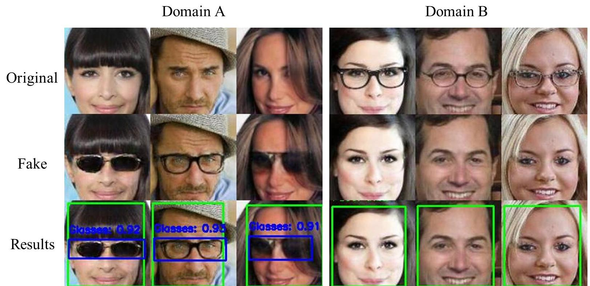
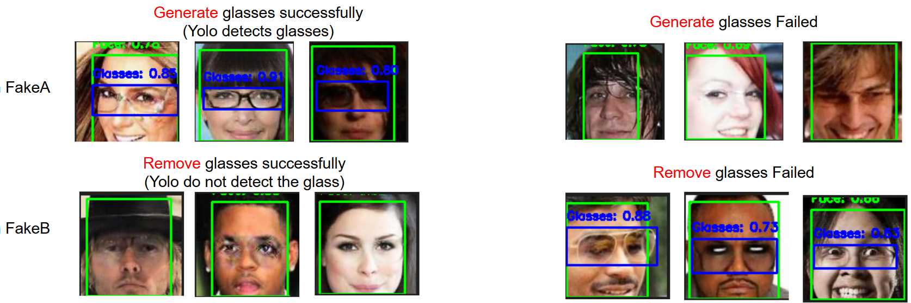
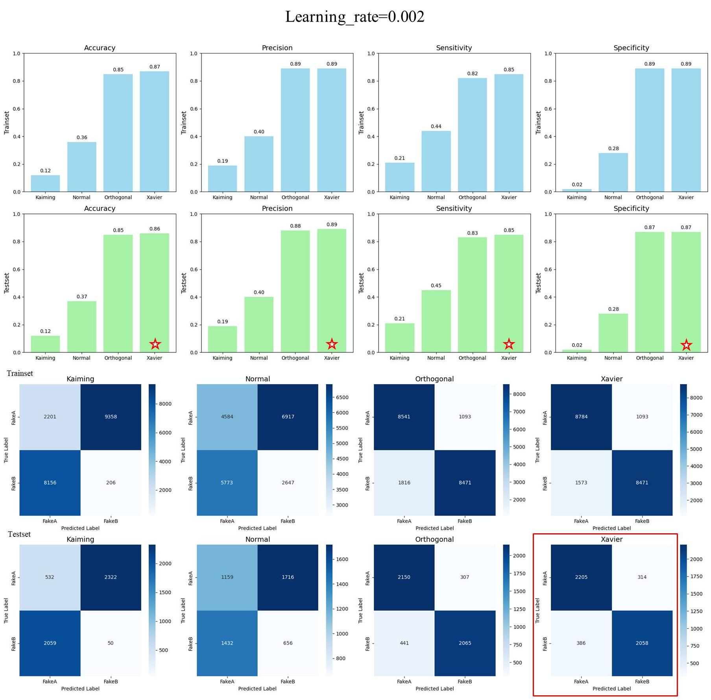

# Unsupervised Semantic Editing with CycleGAN and Evaluation Framework

This project extends the original CycleGAN-based unsupervised feature disentanglement and cross-domain translation by introducing:  
- **Automated object detection–based evaluation metrics** (YOLO / GroundingDINO)  
- **Systematic hyperparameter tuning and analysis**  

Due to time constraints, the source code is still being organized and will be released later. Thanks for your understanding!  

If you are interested in the work, please check out the [**Project Report**](Research_project_1.pdf), which contains detailed workflows and experimental results.  

## 📌 Background & Motivation

In this project, we leverage **unpaired data** to learn the shared and distinct features between two facial subdomains:  
- **Domain A**: Faces without eyeglasses  
- **Domain B**: Faces with eyeglasses  

The goal is to enable **cross-domain transformations** such as *adding* or *removing* eyeglasses.  

1. **Beyond FID metrics**  
   While image-level metrics like **FID** are widely used, they often fail to capture semantic correctness. A model may achieve a low FID score but still fail to reliably add or remove eyeglasses.  
   → To address this, we introduce an **object detection–based evaluation framework**, where pretrained detectors explicitly verify whether the intended semantic edit (eyeglasses on/off) has been achieved.

2. **Hyperparameter sensitivity**  
   Network performance is highly influenced by **weight initialization** and **learning rate**.  
   We systematically explored different initialization strategies and learning rates, recording their impact with both FID and detection-based semantic metrics.  

---

## 📝 Notes
Our method is inspired by the idea proposed in [Unpaired Image-to-Image Translation using Cycle-Consistent Adversarial Networks](https://arxiv.org/abs/1703.10593v4) (CycleGAN).

⭐️ Feel free to star this repo and reach out with any issues or suggestions!  
